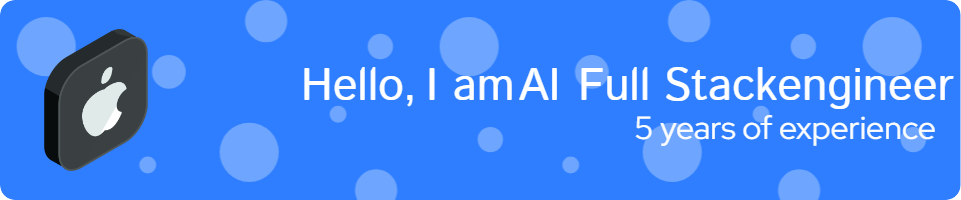

<h3 align="left">👩‍💻  About Me</h3>

#####

I specialize in AI. I completed quick engineering using LangChain and prompt Engineering in OpenAI. As a specialist in 𝐅𝐮𝐥𝐥-𝐒𝐭𝐚𝐜𝐤 𝐃𝐞𝐯𝐞𝐥𝐨𝐩𝐦𝐞𝐧𝐭, I have a proven track record of delivering innovative solutions utilizing a diverse technology stack that includes JavaScript, Python, PHP, Node.js, and both SQL and NoSQL databases. My expertise in 𝐟𝐫𝐨𝐧𝐭-𝐞𝐧𝐝 𝐥𝐢𝐛𝐫𝐚𝐫𝐢𝐞𝐬 𝐚𝐧𝐝 𝐟𝐫𝐚𝐦𝐞𝐰𝐨𝐫𝐤𝐬 such as React, Vue, Next.js, Nuxt.js, as well as 𝐛𝐚𝐜𝐤-𝐞𝐧𝐝 𝐭𝐞𝐜𝐡𝐧𝐨𝐥𝐨𝐠𝐢𝐞𝐬 𝐟𝐫𝐚𝐦𝐞𝐰𝐨𝐫𝐤𝐬 like Express, Laravel, and Strapi enables me to create scalable applications for both front-end and back-end environments.  As a Certified Solutions Architect with 𝐨𝐯𝐞𝐫 7 𝐲𝐞𝐚𝐫𝐬 of experience in full-stack and AI development, I am committed to delivering high-quality technology solutions. My systematic approach ensures that projects are executed on time and meet the highest standards of excellence.

###

<h3 align="left">🛠 Language and tools</h3>

###

  
  
  
  
  
  
  
  
  
  
  
  
  
  
  
  
  
  
  
  
  
  
  
  
  
  
  
  
  
  
  
  
  
  
  
  
  

###

<h3 align="left">🔥   My Stats :</h3>

###

  

###

  
  

###

  

###
